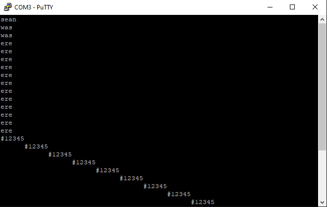
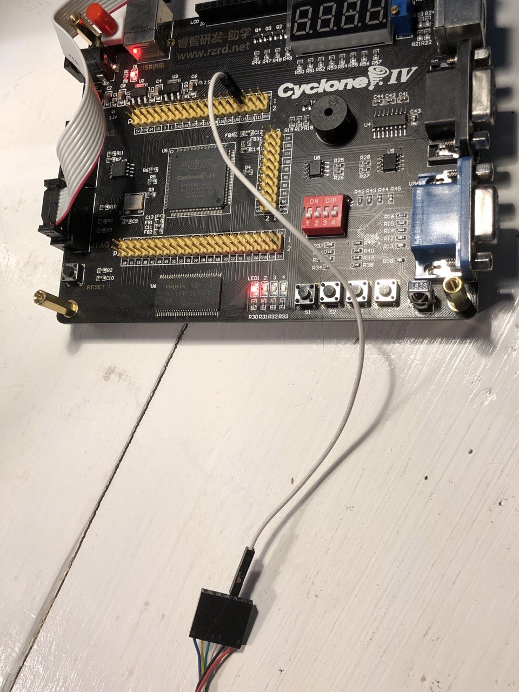
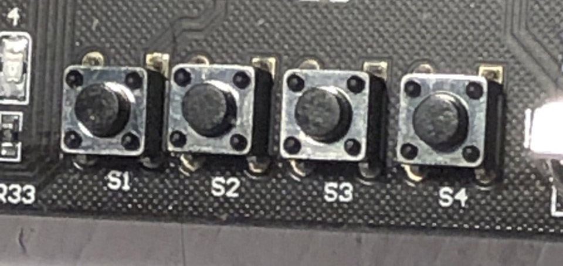
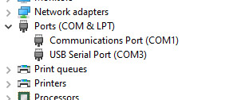
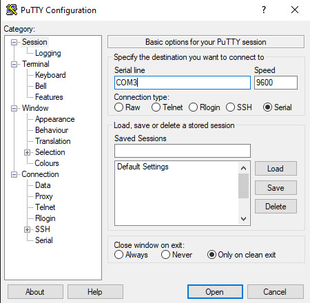
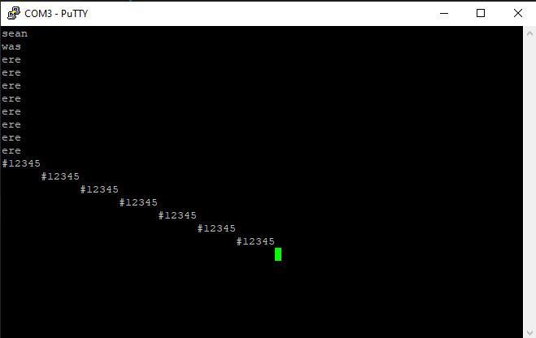
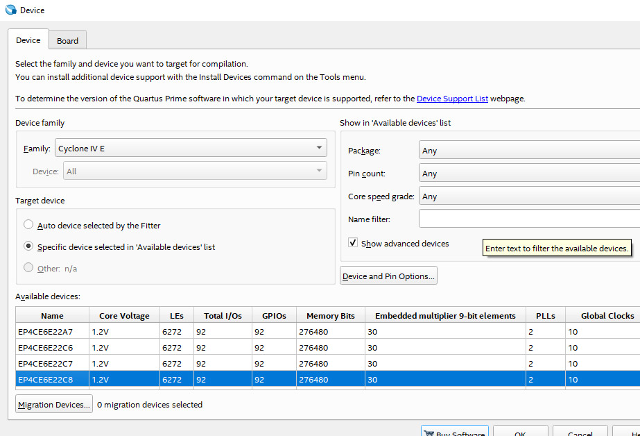
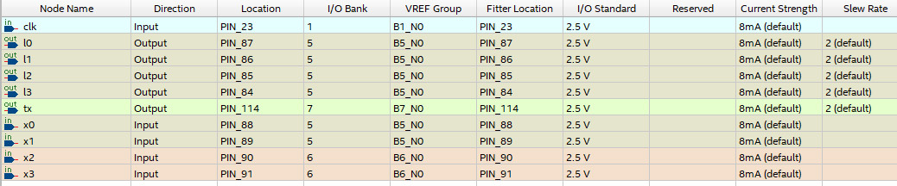

# Cyclone IV FGPA Serial UART TX

Send text using UART TX on Cyclone IV EP4CE6E22C8N to COM port on Windows PC.

My CYCLONE IV EP4CE6E22C8N Board has 4 buttons. When either button is pressed, I have programmed it to send one of 4 different text strings through UART TX pin 114. My Windows 10 receives the text on COM3 and displays it in [Putty](https://www.chiark.greenend.org.uk/~sgtatham/putty/latest.html).

## Example Output

## Cyclone IV Dev Board with UART TTL USB Cable Plugged nto pin 114

Note that the white wire is connecting pin 114 on the Cyclone IV to the RXD pin on my [USB to TTL Serial Cable](https://amzn.to/3r5YbnZ).

## Buttons on Cyclone IV Dev Board

When these buttons are pressed, it sends the binary out of the UART TX pin on the Cyclone IV.

## Windows Device Manager

Windows 10 Device Manager showing the [USB to TTL Serial Cable](https://amzn.to/3r5YbnZ) is discovered on COM3.

## Connect Putty to COM3

Select `Serial` option and use `COM3` if your device manager shows `COM3`. Otherwise use whatever COM number your USB TTL was assigned by your PC. I have programmed this code to send at 9600 BAUD rate speed.

Press the [OPEN] button on Putty and start pressing buttons on Cyclone IV Dev board.

## Device Settings

Device settings for my CYCLONE IV EP4CE6E22C8N Board in Quartus Prime Lite edition V21.1

## Pin Assignments

Assigned pins using Quartus Prime Lite edition V21.1

## How does this work?

The CYCLONE IV clock (Pin 23) is running at 50 Mhz. 

If there are bits to send, then 1 bit is sent per 5208 ticks of the clock.

`50000000 / 5208` results in bits being sent across the wire at 9600 BAUD rate.

Each letter takes 10 bits to send.
`0` for the `START` bit,
`8` bits for the ASCII character, but reversed
`1` for the `STOP` bit.

E.g.,
ASCII letter **A** = `01000001`
When bits are reversed = `10000010`
add `START` and `STOP` bits, it then becomes `0100000101`

If all code is running, installed and devices wired correctly, then sending `0100000101` one bit at at time at a rate of 9600 BAUD results in the character `A` being written on the Putty screen.

In my code example, depending on which button is pressed, it will send all the bytes required to show one of 4 collections of characters on Putty.

1. `sean\r\n`
2. `was \r\n`
3. `ere \r\n`
4. `#12345\n`

## Is this a perfect solution?

No. 

Read the [license](LICENSE).
